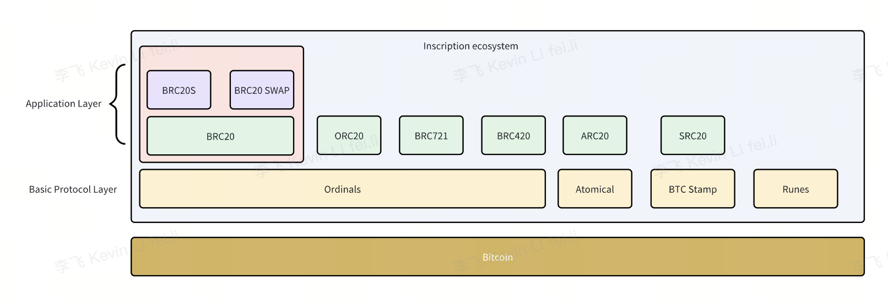
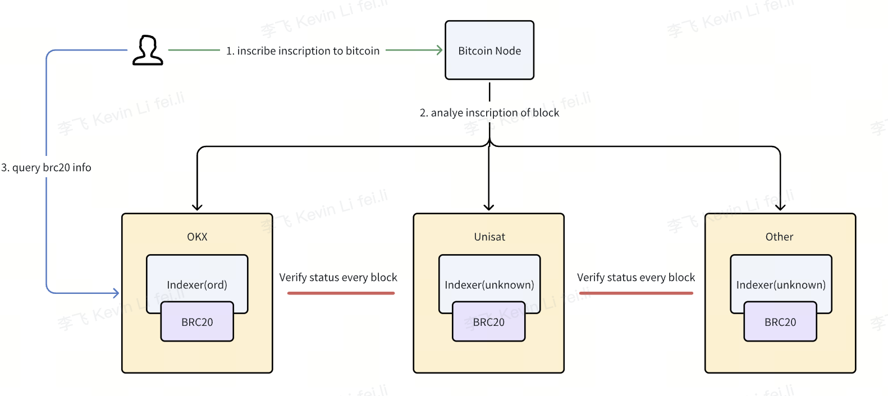
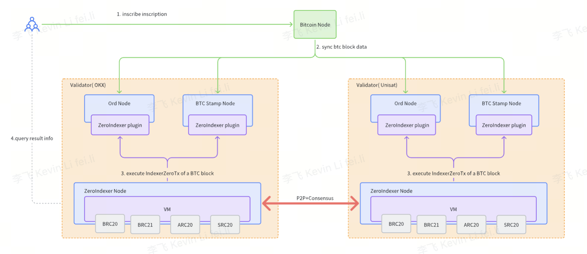

# ZeroIndexer: A decentralized indexer that supports VM and consensus
## Backgroud

The inscriptions ecosystem is thriving with the emergence of various protocols such as Ordinals, BRC20, Atomics, SRC20, etc. We have simply layered the inscription ecology.
- **Basic protocol layer**: The basic protocol layer establishes the storage location and transfer rules for inscriptions within a transaction, specifically for non-fungible tokens (NFTs). Examples of such protocols include Ordinals, Atomic, and BTC Stamp.
- **Application layer**: The inscription application layer defines specific rules and functionalities based on the basic protocol. Protocols like BRC20 and SRC20 are examples of such applications that build upon the inscription protocol.

At the same time, the BRC20 or other protocols analysis encounters two critical challenges:
1. **Centralized Indexers and Data Consistency**: The centralized nature of current BRC20/SRC20 indexers results in high maintenance costs for ensuring data consistency. This centralization necessitates frequent reconciliation and verification processes, and discrepancies between parsers can lead to significant ledger errors if not addressed promptly.
2. **Protocol Creation/Upgrades and Indexer Dependency**: Projects creating or upgrading application protocols (e.g., BRC20S, BRC20Swap, SRC20, ARC20) must either develop their own indexer service code for protocol analysis or collaborate with existing indexers like Unitsat/OKX. This dependency severely hampers the issuance and scalability of new protocols.
   
The current utilization of BRC20 tokens resembles a primitive phase, akin to the early days of ERC20 during ICO issuance. However, there's potential for significant evolution. If other protocols could interact with and respond to the activities and status of BRC20 (such as transfers), it might pave the way for the establishment of a more integrated and robust DeFi ecosystem. This integration would mark a significant advancement from the current, more isolated operational mode of BRC20 tokens, fostering a more interconnected and dynamic blockchain environment.

## Introduction
To address the identified challenges with the inscription ecosystem, we introduce the ZeroIndexer solution. This approach leverages the existing indexer service infrastructure, integrating VM and consensus technology. The key innovation lies in enabling multiple indexers to collaborate within a consortium blockchain framework.

ZeroIndexer is conceptualized as a foundational BTC indexer infrastructure, designed to offer indexing services to various protocol entities. Once a protocol is registered with ZeroIndexer, the system efficiently indexes the protocol's inscriptions. These inscriptions are then processed by the index protocol contract, which is pre-deployed by the protocol entity.
The BRC-ZERO solution offers several compelling advantages:
- **Simplified Protocol Management**: Protocol project entities are required only to develop smart contracts for crating or upgrading application protocols. For instance, the SRC20/BRC20 protocol can be interpreted and managed through a dedicated smart contract.
- **Enhanced Data Consistency**: This solution effectively resolves the issue of data consistency across parsing nodes, ensuring a more reliable and accurate ledger.
- **Boost to Inscription Ecosystem Development**: By facilitating easier integration and management of protocols, ZeroIndexer significantly contributes to the growth and diversification of the inscription ecosystem. Importantly, it paves the way for integrating DeFi into the Inscription ecosystem, heralding a new era of innovation and interconnectivity.
  In essence, ZeroIndexer represents a strategic leap forward, offering a more streamlined, consistent, and expansive framework for the evolution of the inscription ecosystem.

### Key Features
| Key | Explanation | Remark |
| --- | --- | --- |
| 1 | ZeroIndexer Node | Decentralized service node with consensus and supporting EVM |
| 2 | Ord Node | Analyzing the ordinal's inscription data in the BTC network. It doesn't necessarily need to be Ord, any node capable of parsing the inscription data will suffice. |
| 3 | BTC Stamp Node | Analyzing the stamp's inscription data in the BTC network. |
| 4 | ZeroIndexer Plugin | Converts inscription data to ZeroIndexerTx and provides it for the ZeroIndexer network. |
| 5 | Bitcoin Node | Bitcoin full node. |
| 6 | ZeroIndexerTx | ZeroIndexer inscription: The transaction recognized by ZeroIndexer, with the main content being the inscription. |

The Ord Node or BTC Stamp Node processes inscriptions within BTC blocks and provides them to the ZeroIndexer Node's VM for execution. Subsequently, the VM's execution results are subject to consensus voting by the ZeroIndexer nodes

## Objective
1. ZeroIndexer's decentralized consensus mechanism addresses the issue of over-centralization in inscription indexing, thereby bolstering the stability of the inscription ecosystem.
2. ZeroIndexer's indexer service facilitates the development of an increasing number of inscription protocols.

## Notice
1. ZeroIndexer exclusively derives its transaction data from BTC inscriptions.
2. ZeroIndexer utilizes the PBFT consensus mechanism, which requires 3F+1 nodes, with a minimum of 2F+1 honest nodes. Additionally, there are plans to incorporate BTC miners as validators in this consensus network.
3. Currently, ZeroIndexer operates without an incentive structure or user fees. Its main focus is on decentralized protocol analysis and VM execution

## Status
- ZeroIndexer has successfully completed code development and is currently undergoing internal testing.
- It already supports the BRC20 protocol and is in the process of replacing OKX's BRC20 analysis.
- ZeroIndexer can also support any protocol deployment based on the Ordinals protocol.
- Additionally, preparations are underway to support protocols based on Atomicals and BTCStamp, such as ARC20 and SRC20.
- A simplified flow is being designed to accommodate protocols that have been in operation for an extended period.
